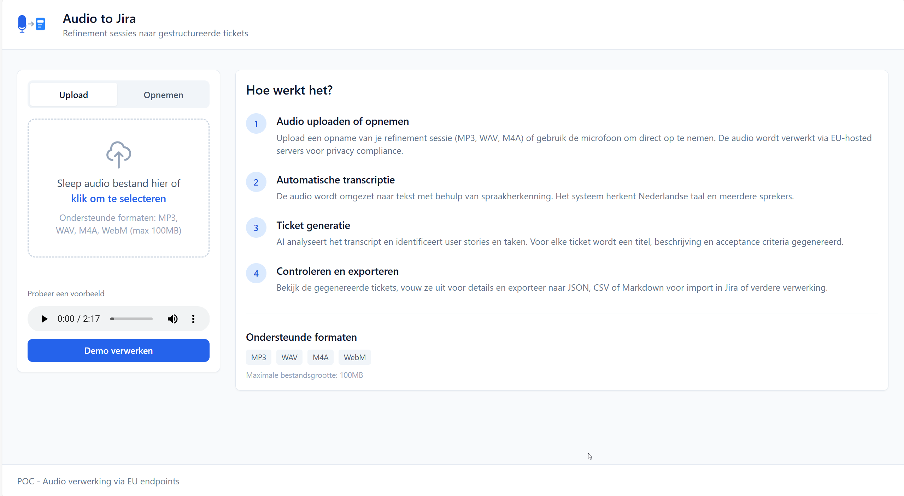
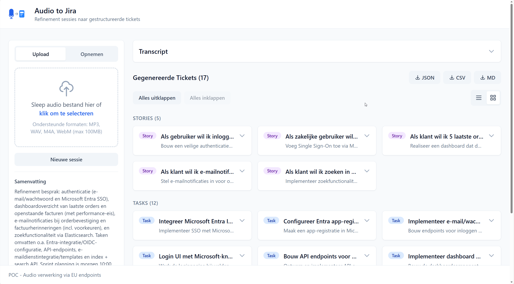
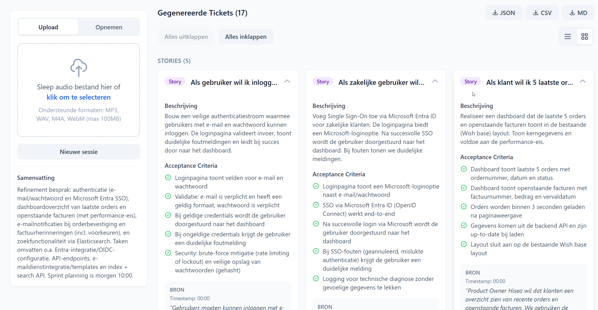

# Speech-to-Jira

Convert audio recordings from refinement sessions into structured Jira tickets using speech-to-text and AI.

## Overview

This application transcribes audio recordings of refinement/planning sessions and automatically generates Jira-ready tickets (User Stories and Tasks) with titles, descriptions, and acceptance criteria.

## Features

- **Audio Upload**: Support for MP3, WAV, M4A, and WebM formats (up to 100MB)
- **Live Recording**: Record directly from your microphone in the browser
- **Speech-to-Text**: Transcription using Deepgram (EU endpoint for GDPR compliance)
- **AI Ticket Generation**: Automatic extraction of User Stories and Tasks from transcripts
- **Export Options**: Download tickets as JSON, CSV, or Markdown
- **Dutch Language Support**: Optimized for Dutch refinement sessions

## Screenshots

### Upload & Instructions

*Upload audio files or record directly, with step-by-step guidance*

### Generated Tickets Overview

*View all generated Stories and Tasks in a clean grid layout*

### Ticket Details

*Expand tickets to see descriptions, acceptance criteria, and source references*

## Tech Stack

- **Frontend**: Next.js 15, React 19, TypeScript, Tailwind CSS
- **Backend**: Bun, Elysia
- **Speech-to-Text**: Deepgram Nova-2 (EU endpoint)
- **AI**: Azure OpenAI

## Getting Started

### Prerequisites

- [Bun](https://bun.sh) runtime
- Deepgram API key (EU endpoint access)
- Azure OpenAI API access

### Environment Setup

Create a `.env` file based on `.env.example`:

```bash
cp .env.example .env
```

Configure the following environment variables:

```env
# Deepgram API (EU endpoint)
DEEPGRAM_API_KEY=your_deepgram_api_key

# Azure OpenAI
AZURE_OPENAI_ENDPOINT=https://your-resource.cognitiveservices.azure.com
AZURE_OPENAI_API_KEY=your_azure_openai_key
AZURE_OPENAI_DEPLOYMENT=gpt-4
AZURE_OPENAI_API_VERSION=2024-02-15-preview

# Server
PORT=4000
```

### Installation

```bash
# Install backend dependencies
cd backend
bun install

# Install frontend dependencies
cd ../frontend
bun install
```

### Running Locally

```bash
# Start backend (from backend folder)
bun run dev

# Start frontend (from frontend folder, in another terminal)
bun run dev
```

The frontend will be available at `http://localhost:3001` and the backend at `http://localhost:4000`.

### Docker

Build and run with Docker Compose:

```bash
docker-compose up --build
```

## API Endpoints

| Endpoint | Method | Description |
|----------|--------|-------------|
| `/` | GET | Health check and API info |
| `/health` | GET | Health status |
| `/api/transcribe` | POST | Transcribe audio file |
| `/api/generate` | POST | Generate tickets from transcript |
| `/api/process` | POST | Combined: transcribe and generate |

## Usage

1. Upload an audio recording or use the microphone to record a session
2. Wait for transcription and AI processing
3. Review the generated tickets (Stories and Tasks)
4. Export in your preferred format (JSON, CSV, or Markdown)
5. Import into Jira or your project management tool

## License

MIT
